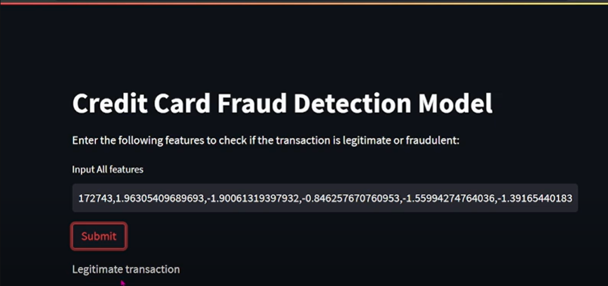

# Cobblestone Energy : Project - Real Time Creditcard Fraud Detection

Credit card fraud is a major concern for both consumers and financial institutions. Fraudulent transactions can lead to financial losses and damage to the reputation of financial institutions. Machine learning techniques have been used extensively to detect fraudulent transactions. In this project, we use logistic regression to classify transactions as either legitimate or fraudulent based on their features.

## Screenshots

